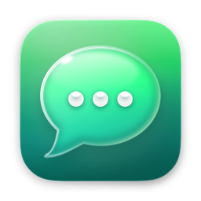
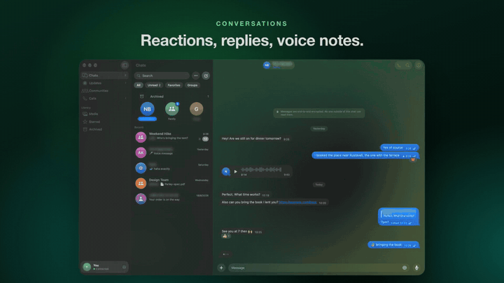

<div align="center">



# Parley

### WhatsApp, as a real Mac app.

Native SwiftUI. Liquid Glass. Notifications you can answer. Your chats one click away in the menu bar.

[**Download for Mac**](https://github.com/mberrishdev/parley/releases/latest/download/Parley.dmg) · [Watch the demo](media/parley-demo.mp4) · [What's new](https://github.com/mberrishdev/parley/releases)

<sub>macOS 26 or later · Apple Silicon · Free</sub>

<a href="https://github.com/mberrishdev/parley/releases"></a>
<a href="https://github.com/mberrishdev/parley/releases/latest"></a>

<br>

<a href="media/parley-demo.mp4"></a>

<sub>▶︎ <a href="media/parley-demo.mp4">Watch the full 53-second walkthrough, with sound</a></sub>

</div>

---

## Why Parley

The official WhatsApp app on the Mac feels like a web page in a window. Parley is built the way Apple builds Messages:
a native three-pane layout, Liquid Glass throughout, real keyboard shortcuts, and notifications that behave like a Mac app's should.

It links to your phone exactly like WhatsApp Web does. Scan a QR code once and your chats are on your Mac, still end-to-end encrypted.

## Features

<table>
<tr><td width="50%" valign="top">

**💬 Conversations**
- Bubbles with delivery ticks, replies, edits and "delete for everyone"
- Reactions: hover or double-click any message
- Voice messages: record with a live waveform, play at 1×, 1.5× or 2×
- Photos, videos, GIFs, stickers and documents
- Drag and drop, paste, or pick from Photos
- WhatsApp formatting: `*bold*`, `_italic_`, `~strike~`, ```` ```code``` ````
- Forward, star, save, and find in a conversation (⌘F)

</td><td width="50%" valign="top">

**🔔 Stays out of your way**
- Notifications with inline reply and Mark as Read
- Muted chats stay silent, and you can pause everything for an hour
- A menu bar icon with your latest chats and quick reply
- Open at login, Dock badge, optional Dock-free mode
- Online and last seen, typing indicators
- Calls ring on your phone. Parley shows who's calling and your call history

</td></tr>
<tr><td valign="top">

**👥 People and groups**
- Start a chat with any number, even one that isn't in your contacts
- Create groups, rename them, write descriptions, share invite links
- Members with admin badges, block and unblock
- Pin, archive, favorite, and mark read or unread (pin, archive and read sync to your phone)

</td><td valign="top">

**✨ Everything else**
- Status updates in a full-screen story viewer, and post your own
- Communities, a media gallery, starred messages
- Six chat wallpapers, adjustable text size
- Privacy controls: last seen, read receipts, profile photo and more
- Light and dark mode, and keyboard shortcuts everywhere

</td></tr>
</table>

## Install

1. [Download `Parley.dmg`](https://github.com/mberrishdev/parley/releases/latest/download/Parley.dmg) and drag **Parley** into **Applications**.
2. Open Parley. The first time, macOS may say it can't check the app for malicious software, because Parley isn't notarized by Apple yet. Go to **System Settings › Privacy & Security** and click **Open Anyway**.<br>
   <sub>Or, in Terminal: `xattr -dr com.apple.quarantine /Applications/Parley.app`</sub>
3. On your phone, open WhatsApp › **Settings** › **Linked Devices** › **Link a Device**, and scan the code Parley shows.
4. Allow notifications when asked. You can check them anytime in **Parley › Settings › Notifications › Send Test Notification**.

**Requirements:** macOS 26 Tahoe or later, on a Mac with Apple Silicon (M1 or newer).

## Keyboard shortcuts

| | |
|---|---|
| New chat | ⌘N |
| New group | ⇧⌘N |
| Find in conversation | ⌘F |
| Contact or group info | ⌘I |
| Next / previous chat | ⌃⇥ / ⌃⇧⇥ |
| Chats · Updates · Communities · Calls | ⌘1 – ⌘4 |
| Mark as read or unread · Pin · Mute · Archive | ⇧⌘U · ⇧⌘P · ⇧⌘M · ⇧⌘E |
| Send | Return, or ⌘Return, whichever you choose in Settings |

## Privacy

- Parley is a **linked device**, like WhatsApp Web. Messages stay end-to-end encrypted between your phone, your contacts and your Mac.
- Everything is stored **only on your Mac**, in `~/Library/Application Support/Parley`. There are no Parley servers, no accounts, no analytics.
- **Log Out** in Settings unlinks this Mac and deletes the local copy of your messages and media.

## FAQ

**Is this official?**
No. Parley is an independent app, not affiliated with, endorsed by, or connected to WhatsApp or Meta.

**Can my account get banned?**
Third-party clients are against WhatsApp's Terms of Service, and WhatsApp can restrict accounts that use them. Normal personal use is rarely affected, but the risk is real and it's yours to take.

**Can I make calls?**
No. WhatsApp only lets phones place and answer calls. Parley alerts you to incoming calls and keeps your call history.

**Why isn't the app notarized?**
Notarization needs a paid Apple Developer ID. Until then, macOS asks you to click **Open Anyway** after installing each new version (see Install).

---

<div align="center">
<sub>WhatsApp is a trademark of WhatsApp LLC. Parley is not affiliated with WhatsApp or Meta.</sub>
</div>
